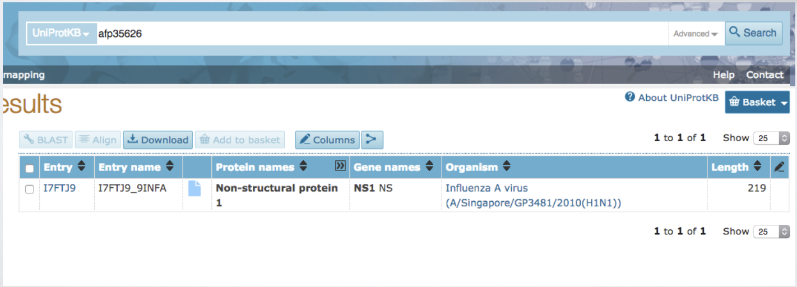

#### MSA MEGA File Parser #####
This tool is mainly to parse through an MSA file (in the MEGA format) and give out a UI representation of the analysis of the mutations occurred.

### How do I get set up? ###

* Still in the development phases. Would be putting out a link to the binaries once the complete development and testing is done.

### Contribution guidelines ###

### Functionality ###

2 widgets:

*  First (main) widget asks user to select MEGA file from desktop. It shows minimal information of how many mutations and the score. 
  * * The main window lets you select the MEGA file from your file browser

  
  * * Once the file is selected it displays to you the details in the tabular form as shown.

  
* Second window pops up when user double clicks the residue . It shows a detailed overview of the mutations.

* * The following is an example when a residue is clicked from the first window.

### Buttons and their functions ###

* * Residue range selection: This lets you select the range of residues that you particularly want to filter out. Note: Should click the Apply Filter button for it to be effective.

* * Substitution Matrix score-threshold selection : The score as shown in the 4th column represents the cumulative summation of the scores of the mutations that have happened from the wild type. 
This can be filtered => 1) All scores 2) Scores < 0 3) Scores < -1

* * Double-click on the residue from the detailed window will take you to the Uniprot page of the strain.

Uniprot Query : 

### Who do I talk to? ###

* Shiva Kannan <sssk2006@gmail.com>